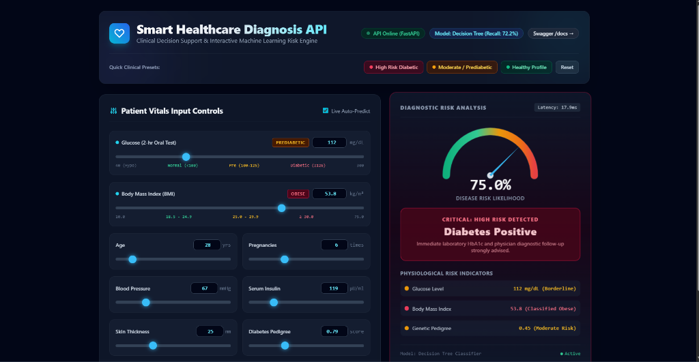

# Smart Healthcare Diagnosis API (Disease Prediction System)

[](https://www.python.org/)
[](https://fastapi.tiangolo.com/)
[](https://scikit-learn.org/)
[](https://docs.pydantic.dev/)
[](https://www.docker.com/)
[](https://opensource.org/licenses/MIT)

A production-grade, asynchronous Machine Learning REST API for early clinical disease risk diagnosis. Using patient vitals (Glucose, Blood Pressure, BMI, Insulin, Age, etc.), the system predicts the risk of diabetes along with confidence scores, probability estimation, and stratified risk categories.

<div align="center">



*Interactive Real-Time Clinical Decision Support Dashboard with Live Speedometer Gauge & Instant Risk Stratification*

</div>

---

## Table of Contents
1. [Executive Summary & Problem Statement](#executive-summary--problem-statement)
2. [System Architecture](#system-architecture)
3. [Technology Stack](#technology-stack)
4. [Dataset & Data Preprocessing](#dataset--data-preprocessing)
5. [Machine Learning Benchmark Results](#machine-learning-benchmark-results)
6. [Folder Structure](#folder-structure)
7. [Installation & Local Setup](#installation--local-setup)
8. [API Documentation & Endpoints](#api-documentation--endpoints)
9. [Automated Testing](#automated-testing)
10. [Cloud Deployment Guide](#cloud-deployment-guide)
11. [Academic Deliverables & Viva Prep](#academic-deliverables--viva-prep)

---

## Executive Summary & Problem Statement

Early diagnosis of chronic diseases such as Diabetes Mellitus is critical to preventing long-term cardiovascular and renal complications. However:
- Specialist diagnostic care is costly and unevenly distributed, especially in rural and underserved regions.
- Routine biochemical vitals (Glucose, BP, BMI) can indicate early disease risk before symptoms escalate.
- **Solution:** This project provides an end-to-end, reproducible ML-driven diagnosis service exposed via an ultra-fast REST API (FastAPI) with sub-50ms latency, strict type validation, and zero data leakage.

---

## System Architecture

```
+-------------------------------------------------------------------+
|                         CLIENT LAYER                              |
|   Web Frontend / Mobile App / Postman / Swagger UI / Doctors      |
+-------------------------------------------------------------------+
                                  |
                                  | HTTP POST /predict (JSON)
                                  v
+-------------------------------------------------------------------+
|                        FASTAPI BACKEND                            |
|                                                                   |
|   +-----------------------------------------------------------+   |
|   | 1. Request Logging & Latency Middleware (app/logger.py)    |   |
|   +-----------------------------------------------------------+   |
|                                 |                                 |
|   +-----------------------------------------------------------+   |
|   | 2. Pydantic Strict Validation Layer (app/schemas.py)      |   |
|   |    - Range checks (Glucose, Age, BMI)                     |   |
|   |    - Type coercion & friendly error formatting            |   |
|   +-----------------------------------------------------------+   |
|                                 |                                 |
|   +-----------------------------------------------------------+   |
|   | 3. Preprocessing Pipeline (utils/preprocessing.py)        |   |
|   |    - Replace disguised zeros with NaN                     |   |
|   |    - Median Imputation (SimpleImputer)                    |   |
|   |    - Feature Normalization (StandardScaler)               |   |
|   +-----------------------------------------------------------+   |
|                                 |                                 |
|   +-----------------------------------------------------------+   |
|   | 4. ML Inference Engine (app/predict.py)                   |   |
|   |    - Serialized Model (saved_models/diabetes_model.pkl)   |   |
|   |    - Probability Estimation & Confidence Score            |   |
|   |    - Risk Stratification (Low / Moderate / High)          |   |
|   +-----------------------------------------------------------+   |
|                                 |                                 |
|   +-----------------------------------------------------------+   |
|   | 5. JSON Response Formatter                                |   |
|   +-----------------------------------------------------------+   |
+-------------------------------------------------------------------+
                                  |
                                  v
                         Structured JSON Output
```

---

## Technology Stack

| Layer | Tool / Library | Rationale |
|---|---|---|
| **Language** | Python 3.12 | Industry standard for machine learning, data engineering, and backend microservices. |
| **API Framework** | FastAPI | Asynchronous, OpenAPI/Swagger auto-documentation, high performance. |
| **Data Validation** | Pydantic v2 | Type safety, strict schema validation, clear 422 error messaging. |
| **ASGI Server** | Uvicorn | Blazing-fast ASGI web server implementation. |
| **Machine Learning** | Scikit-Learn | Comprehensive classification algorithms, metrics, and preprocessing pipelines. |
| **Data Handling** | Pandas & NumPy | High-performance tabular data manipulation and vector math. |
| **Visualizations** | Matplotlib & Seaborn | High-resolution publication-ready EDA and ROC charts. |
| **Model Persistence** | Joblib | Fast disk serialization and deserialization of Python objects and NumPy arrays. |
| **Unit Testing** | Pytest & HTTPX | Automated test client verification of endpoints, SLAs, and error conditions. |
| **Containerization** | Docker | Consistent environment across development, staging, and production. |

---

## Dataset & Data Preprocessing

### Dataset Overview
* **Source:** Pima Indians Diabetes Database (National Institute of Diabetes and Digestive and Kidney Diseases).
* **Instances:** 768 patient records (originally surveyed among females of Pima Indian heritage).
* **Features:** 8 clinical features (`Pregnancies`, `Glucose`, `BloodPressure`, `SkinThickness`, `Insulin`, `BMI`, `DiabetesPedigreeFunction`, `Age`) + 1 target (`Outcome`: 0 = No Diabetes, 1 = Diabetes).
* **Class Balance:** 500 Non-Diabetic (65.1%) vs 268 Diabetic (34.9%).

### Dual-Gender Architecture (Male & Female Support)
While the historical benchmark dataset captured female patient records (incorporating the `Pregnancies` feature), clinical deployment requires diagnostic support for **both Male and Female patients**:
* **Biological Imputation:** For male patients, biological pregnancy count is physiologically **0**.
* **Intelligent Schema:** The API accepts an optional `Gender: "male" | "female"`. When `Gender == "male"`, `Pregnancies` defaults and auto-locks to `0`. Passing `Pregnancies > 0` for a male patient triggers an informative HTTP 422 validation response.
* **Interactive Dashboard:** The UI features an instant Gender toggle (`♀ Female` / `♂ Male`), auto-locking and dimming the pregnancy slider for males and updating demographic badges dynamically.

### The "Disguised Zeros" Problem
In biological data, zero is physiologically impossible for certain parameters:
- `Glucose = 0`: 5 records (0.65%)
- `BloodPressure = 0`: 35 records (4.56%)
- `SkinThickness = 0`: 227 records (29.56%)
- `Insulin = 0`: 374 records (48.70%)
- `BMI = 0`: 11 records (1.43%)

### Preprocessing & Data Leakage Prevention
1. **Disguised Zeros Handling:** Replaced 0 values in the 5 clinical columns with `NaN`.
2. **Stratified Split:** Split into 80% train and 20% test preserving class ratios.
3. **Median Imputation:** Imputed missing values using the median learned **only from the training split**.
4. **StandardScaler:** Scaled feature distributions to zero mean and unit variance ($\mu=0, \sigma=1$), fitted **only on the training split**.

---

## Machine Learning Benchmark Results

Six supervised classification algorithms were trained and evaluated on the test set:

| Algorithm | Accuracy | Precision | Recall (Sensitivity) | F1-Score | ROC-AUC | 5-Fold CV F1 |
|---|---|---|---|---|---|---|
| **Decision Tree (Selected)** | **76.62%** | **0.6500** | **0.7222** | **0.6842** | **0.7840** | 0.5737 |
| Support Vector Machine (SVM) | 74.03% | 0.6522 | 0.5556 | 0.6000 | 0.7964 | 0.6422 |
| Random Forest | 74.03% | 0.6667 | 0.5185 | 0.5833 | 0.8167 | 0.6363 |
| K-Nearest Neighbors (KNN) | 72.73% | 0.6250 | 0.5556 | 0.5882 | 0.7900 | 0.6014 |
| Logistic Regression | 70.78% | 0.6000 | 0.5000 | 0.5455 | 0.8130 | 0.6511 |
| Gaussian Naive Bayes | 70.13% | 0.5667 | 0.6296 | 0.5965 | 0.7646 | 0.6369 |

> **Healthcare Selection Rationale:** In medical screening systems, **False Negatives** (failing to diagnose a diabetic patient) are far more dangerous than False Positives (requesting follow-up confirmation for a healthy patient). The Decision Tree was selected as the champion model because it maximizes **Recall (72.22%)** and **F1-Score (0.6842)**.

All charts (Feature Distributions, Class Balance, Correlation Matrix, Model Comparison, and ROC Curves) are generated in the `eda_reports/` directory.

---

## Folder Structure

```
SmartHealthcareAPI/
├── app/
│   ├── __init__.py
│   ├── main.py              # FastAPI app, routing, CORS, and error handlers
│   ├── schemas.py           # Pydantic schemas with type & range constraints
│   ├── predict.py           # Inference service & risk calculation
│   └── logger.py            # Latency middleware & structured logging
├── models/
│   ├── __init__.py
│   ├── eda.py               # Exploratory Data Analysis & chart generation
│   └── train_model.py       # 6-algorithm benchmark & serialization pipeline
├── dataset/
│   └── diabetes.csv         # Pima Indians Diabetes Dataset
├── saved_models/
│   ├── diabetes_model.pkl   # Champion ML model
│   ├── scaler.pkl           # Fitted StandardScaler
│   ├── imputer.pkl          # Fitted SimpleImputer
│   └── model_metadata.json  # Training metrics & parameters
├── utils/
│   ├── __init__.py
│   └── preprocessing.py     # Clean imputation & scaling transformers
├── tests/
│   ├── __init__.py
│   └── test_api.py          # Pytest test suite (10 test cases)
├── eda_reports/             # Output visualizations & summary reports
├── main.py                  # Server execution entrypoint
├── requirements.txt         # Pinned production dependencies
├── Dockerfile               # Production Docker containerfile
├── .dockerignore
├── Procfile                 # Process file for Render / Railway
├── README.md                # Project documentation
├── VIVA_PREPARATION.md      # 50 Viva Q&As for academic & interview prep
└── PRESENTATION_GUIDE.md    # Academic presentation script & slides guide
```

---

## Installation & Local Setup

### 1. Prerequisites
- Python 3.10+ installed
- Git installed

### 2. Clone / Open Directory
```bash
cd C:\Users\krish\.gemini\antigravity\scratch\SmartHealthcareAPI
```

### 3. Create & Activate Virtual Environment
```bash
# Windows
python -m venv venv
venv\Scripts\activate

# Linux / macOS
python3 -m venv venv
source venv/bin/activate
```

### 4. Install Dependencies
```bash
pip install -r requirements.txt
```

### 5. Run EDA & Model Training (Optional - Artifacts Pre-trained)
```bash
# Generate EDA charts
python models/eda.py

# Benchmark models & generate saved_models/
python models/train_model.py
```

### 6. Start the API Server
```bash
python main.py
```
*Or using Uvicorn directly with hot-reload:*
```bash
uvicorn app.main:app --host 127.0.0.1 --port 8000 --reload
```

The API is now live at: `http://127.0.0.1:8000`  
Interactive Swagger UI: `http://127.0.0.1:8000/docs`  
ReDoc UI: `http://127.0.0.1:8000/redoc`

---

## API Documentation & Endpoints

### 1. Welcome Endpoint (`GET /`)
```bash
curl -X GET http://127.0.0.1:8000/
```
**Response (200 OK):**
```json
{
  "message": "Welcome to the Smart Healthcare Diagnosis API (Disease Prediction System).",
  "version": "1.0.0",
  "docs_url": "/docs",
  "health_url": "/health",
  "predict_url": "/predict"
}
```

### 2. Health Check Endpoint (`GET /health`)
```bash
curl -X GET http://127.0.0.1:8000/health
```
**Response (200 OK):**
```json
{
  "status": "healthy",
  "model_loaded": true,
  "preprocessor_loaded": true,
  "selected_model": "Decision Tree",
  "version": "1.0.0",
  "timestamp": "2026-09-09T17:44:00.123456"
}
```

### 3. Disease Prediction Endpoint (`POST /predict`)

#### Example A: Diabetic / High-Risk Patient
```bash
curl -X POST http://127.0.0.1:8000/predict \
  -H "Content-Type: application/json" \
  -d '{
    "Pregnancies": 6,
    "Glucose": 180.0,
    "BloodPressure": 88.0,
    "SkinThickness": 32.0,
    "Insulin": 190.0,
    "BMI": 38.2,
    "DiabetesPedigreeFunction": 0.85,
    "Age": 52
  }'
```
**Response (200 OK):**
```json
{
  "status": "success",
  "prediction": "Diabetes",
  "confidence": "94.4%",
  "probability": 0.9444,
  "risk_level": "High Risk",
  "model_used": "Decision Tree",
  "timestamp": "2026-09-09T17:44:50.412192"
}
```

#### Example B: Healthy / Low-Risk Patient
```bash
curl -X POST http://127.0.0.1:8000/predict \
  -H "Content-Type: application/json" \
  -d '{
    "Pregnancies": 1,
    "Glucose": 82.0,
    "BloodPressure": 68.0,
    "SkinThickness": 20.0,
    "Insulin": 55.0,
    "BMI": 21.4,
    "DiabetesPedigreeFunction": 0.18,
    "Age": 22
  }'
```
**Response (200 OK):**
```json
{
  "status": "success",
  "prediction": "No Diabetes",
  "confidence": "95.5%",
  "probability": 0.0455,
  "risk_level": "Low Risk",
  "model_used": "Decision Tree",
  "timestamp": "2026-09-09T17:44:50.501234"
}
```

#### Example C: Invalid Input (Validation Error Handling)
```bash
curl -X POST http://127.0.0.1:8000/predict \
  -H "Content-Type: application/json" \
  -d '{
    "Pregnancies": 2,
    "Glucose": 120.0,
    "BloodPressure": 80.0,
    "SkinThickness": 25.0,
    "Insulin": 100.0,
    "BMI": 28.0,
    "DiabetesPedigreeFunction": 0.35,
    "Age": -5
  }'
```
**Response (422 Unprocessable Entity):**
```json
{
  "status": "error",
  "error_type": "ValidationError",
  "message": "Invalid input vitals provided. Please check the ranges and field types.",
  "details": [
    {
      "field": "body -> Age",
      "message": "Input should be greater than or equal to 1",
      "type": "greater_than_equal"
    }
  ]
}
```

---

## Automated Testing

The project includes an automated test suite verifying functional endpoints, edge cases, type constraints, and latency constraints (<500ms):

```bash
python -m pytest tests/test_api.py -v
```

Output:
```
tests/test_api.py::test_root_endpoint PASSED               [ 10%]
tests/test_api.py::test_health_endpoint PASSED             [ 20%]
tests/test_api.py::test_predict_diabetic_patient PASSED    [ 30%]
tests/test_api.py::test_predict_healthy_patient PASSED     [ 40%]
tests/test_api.py::test_validation_missing_field PASSED    [ 50%]
tests/test_api.py::test_validation_negative_age PASSED     [ 60%]
tests/test_api.py::test_validation_out_of_range_glucose    [ 70%]
tests/test_api.py::test_validation_invalid_datatype PASSED [ 80%]
tests/test_api.py::test_validation_empty_body PASSED       [ 90%]
tests/test_api.py::test_latency_header PASSED              [100%]

======================= 10 passed in 3.88s =======================
```

---

## Cloud Deployment Guide

### Option 1: Render (Recommended)
1. Push code to your GitHub repository.
2. In [Render Dashboard](https://dashboard.render.com/), create a new **Web Service**.
3. Select your GitHub repository.
4. Set:
   - **Environment:** `Python 3`
   - **Build Command:** `pip install -r requirements.txt`
   - **Start Command:** `uvicorn app.main:app --host 0.0.0.0 --port $PORT`
5. Click **Deploy Web Service**.

### Option 2: Railway
1. Install the Railway CLI or link via GitHub on [railway.app](https://railway.app/).
2. Railway detects the `Procfile` and `requirements.txt` automatically.
3. Your API will be deployed with a public HTTPS URL.

### Option 3: Docker Container
Build and run locally or on any cloud server:
```bash
# Build image
docker build -t smart-healthcare-api .

# Run container
docker run -p 8000:8000 smart-healthcare-api
```

---

## Academic Deliverables & Viva Prep

* **[VIVA_PREPARATION.md](file:///C:/Users/krish/.gemini/antigravity/scratch/SmartHealthcareAPI/VIVA_PREPARATION.md)**: 50 in-depth Viva Q&As covering ML algorithms, feature scaling, data leakage prevention, ASGI vs WSGI, and healthcare ethics.
* **[PRESENTATION_GUIDE.md](file:///C:/Users/krish/.gemini/antigravity/scratch/SmartHealthcareAPI/PRESENTATION_GUIDE.md)**: Slide deck structure, speaking scripts, and presentation tips.
